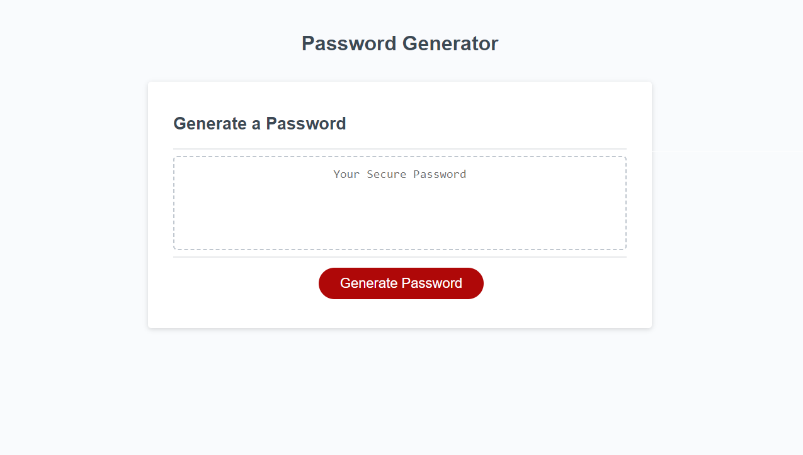

# Password Generator

## Description
This password Generator allows for a custom random password with specific parameters and between 8 and 128 characters long to generated. When you click the generate button, a prompt will ask how many characters long you would like the password to be. Further messages will ask if you want to include lower case letters, upper case letters, numbers, and special characters in your password. After the password is generated, the password will display within the text area.

## Link to Deployed Application
https://iamtrai.github.io/passcode-generator/
